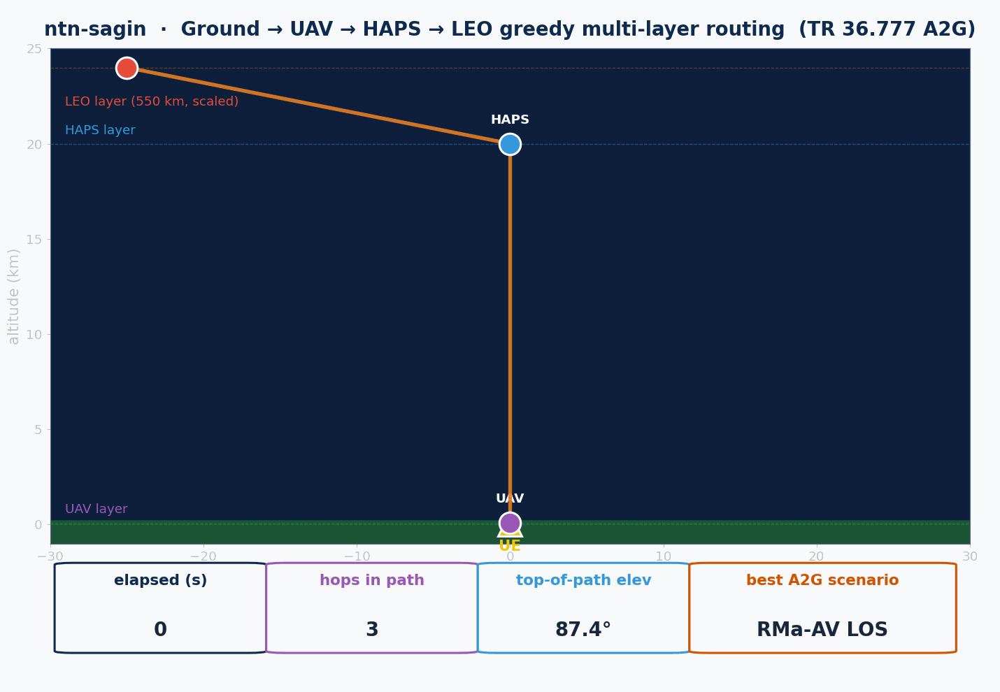

# ntn-sagin

> Space-Air-Ground Integrated Network for ns-3.43 — LEO space layer, an air layer of aircraft / HAPS / UAV swarms, and a ground layer of maritime, high-speed-train and ADS-B terminals, stitched together by a multi-layer / slice-aware router. Part of **ns3-ntn-toolkit** — [README](../../README.md) / [INSTALL](../../INSTALL.md).

<p align="center">
  <a href="https://www.nsnam.org"></a>
  <a href="https://www.gnu.org/licenses/old-licenses/gpl-2.0.en.html"></a>
  
  
  
</p>

---

<p align="center">
  
</p>

## Overview

Most ns-3 NTN work stops at "satellite + ground". A realistic 6G access network spans three
layers — **space** (LEO/MEO/GEO), **air** (HAPS, UAVs, commercial flights) and **ground** — and a
single session frequently traverses two or three of them. `ntn-sagin` models all three:

```
ground UE  ──►  UAV-relay  ──►  HAPS (20 km)  ──►  LEO (550 km)
              ▲ TR 36.777 A2G channel ▲                ▲ free-space / Ka-band link budget
```

- **Space.** LEO passes driven either by analytic ground-track velocity or, via
  `ntn-constellation`, by SGP4 + contact-graph shortest-path ISL routing.
- **Air.** HAPS station-keeping (figure-8 lemniscate + waypoint trajectory), three UAV mobility
  patterns (waypoint / patrol / search-lawnmower), and constant-altitude aeronautical cruise.
- **Ground / mobile terminals.** Maritime **AIS** vessels, **OpenSky ADS-B** aircraft, and
  **high-speed-train** mobility, each with replayable trace feeds.
- **Channel.** 3GPP TR 36.777 v15.0.0 air-to-ground path loss and LOS probability for the
  UMa-AV / RMa-AV / UMi-AV reference scenarios; Ka-band free-space link budgets for the space hops.
- **Routing.** A greedy max-elevation `MultiLayerRouter` (Ground → UAV → HAPS → LEO) and a
  QFI → S-NSSAI slice-aware `SaginSliceRouter` that biases the layer choice by latency budget.

## What's new in v2

See the toolkit [CHANGELOG](../../CHANGELOG.md) for the full history.

- **Flight-LEO KPM now uses a full Ka-band link budget.** EIRP + satellite/aircraft antenna
  gains → realistic RSRP (≈ −73 … −80 dBm), noise-based SINR over the carrier bandwidth,
  Shannon/CQI-driven throughput, and relative-velocity Doppler — replacing the earlier affine SINR
  proxy and the binary 0/80 Mbps throughput.
- **A2G channel applies the TR 36.777 NLOS floor `max(PL_LOS, PL'_NLOS)`.** An obstructed link can
  never report *less* loss than the LOS reference, fixing the short-range dip where the raw NLOS
  formula fell below LOS.

## Models, helpers & key classes

Derived from `model/*.h` and `helper/*.h`.

| Class | Header | Role |
|---|---|---|
| `HapsMobilityModel` | `haps-mobility-model.h` | Lemniscate-of-Bernoulli (figure-8) station-keeping with tanh-clamped ±50 m vertical envelope |
| `HapsTrajectoryMobilityModel` | `haps-trajectory-mobility-model.h` | Waypoint/segment-driven HAPS trajectory playback |
| *(trace)* | `haps-trajectory-trace.h` | Loads / replays HAPS trajectory traces |
| `UavWaypointMobilityModel` | `uav-mobility-models.h` | RNG-driven random-waypoint UAV |
| `UavPatrolMobilityModel` | `uav-mobility-models.h` | Linear A↔B patrol at constant speed |
| `UavSearchPatternMobilityModel` | `uav-mobility-models.h` | Lawnmower search scan with configurable lane spacing |
| `AeronauticalMobilityModel` | `aeronautical-scenario.h` | Constant-altitude / constant-ground-speed cruise |
| `AisMobilityModel` | `ais-mobility-model.h` | Maritime vessel mobility (AIS-style) |
| *(trace)* | `ais-maritime-trace.h` | AIS message trace feed for vessel terminals |
| `OpenSkyMobilityModel` | `opensky-mobility-model.h` | ADS-B aircraft mobility from OpenSky-style feeds |
| *(trace)* | `opensky-adsb-trace.h` | OpenSky ADS-B trace loader |
| `HstMobilityModel` | `hst-mobility-model.h` | High-speed-train mobility along a track |
| *(trace)* | `hst-trace.h` | HST position/speed trace feed |
| `A2gChannelTr36777` | `a2g-channel-tr36777.h` | TR 36.777 v15.0.0 path loss (LOS + NLOS floor) and LOS probability for UMa-AV / RMa-AV / UMi-AV |
| `MultiLayerRouter` | `multi-layer-router.h` | Greedy max-elevation Ground→UAV→HAPS→LEO routing; pluggable `SaginScoreCallback` for RL/external scoring |
| `SaginSliceRouter` | `sagin-slice-router.h` | 5G QFI → S-NSSAI → `SliceProfile` mapping; biases layer choice by latency budget + GEO allowance |
| `SaginHelper` | `sagin-helper.h` | Factory façade: builds a ready-to-route 4-layer scene in one call |

## Examples

Ten example programs ship under `examples/`. Build any of them with `./ns3 build <NAME>`; the binary
lands at `build/contrib/ntn-sagin/examples/ns3.43-<NAME>-default`. Each example below lists two run
forms (via `./ns3 run` and the direct binary), its outputs, and its real `--`args.

The four traffic examples (`-traffic`, multihop, slice, sgp4) instantiate a real ns-3 IP data plane
(NetDevice + IPv4 + applications) and print a **FlowMonitor** summary (throughput, loss, delay) to
the console — they do not write a CSV.

---

### sagin-haps-leo-relay

1 h SAGIN scenario emitting the full 4-layer hop path per second, driven by `NtnRealisticTrafficHelper`.

```bash
./ns3 run "sagin-haps-leo-relay --simTime=3600 --csv=/tmp/sagin.csv"
build/contrib/ntn-sagin/examples/ns3.43-sagin-haps-leo-relay-default --simTime=3600 --csv=/tmp/sagin.csv
```

**Outputs:** `sagin-haps-leo-relay.csv` (per-second hop selection); `sim_health.csv` (written by the
traffic helper, location set by `--outputDir`).
**Key args:** `--simTime`, `--csv`, `--outputDir`.

### sagin-uav-swarm

8-UAV swarm (mix of waypoint/patrol/search patterns) with TR 36.777 A2G path-loss spot-checks.

```bash
./ns3 run "sagin-uav-swarm --simTime=600 --fcGHz=2.0 --csv=/tmp/uav.csv"
build/contrib/ntn-sagin/examples/ns3.43-sagin-uav-swarm-default --simTime=600 --fcGHz=2.0 --csv=/tmp/uav.csv
```

**Outputs:** `sagin-uav-swarm.csv`; `sim_health.csv` (traffic helper, via `--outputDir`).
**Key args:** `--simTime`, `--fcGHz`, `--csv`, `--outputDir`.

### sagin-aeronautical

1 h commercial-flight cruise under a passing LEO satellite, driven by `NtnRealisticTrafficHelper`.

```bash
./ns3 run "sagin-aeronautical --simTime=3600 --cruise=11000 --speed=250 --csv=/tmp/aero.csv"
build/contrib/ntn-sagin/examples/ns3.43-sagin-aeronautical-default --simTime=3600 --cruise=11000 --speed=250 --csv=/tmp/aero.csv
```

**Outputs:** `sagin-aeronautical.csv`; `sim_health.csv` (traffic helper, via `--outputDir`).
**Key args:** `--simTime`, `--cruise`, `--speed`, `--csv`, `--outputDir`.

### sagin-flight-leo-e2

Roadmap §4.4.9 — commercial flight + LEO pass emitting OAI-style O-RAN E2-KPM indications (RSRP /
SINR / CQI / elevation / Doppler / one-way delay) to a Near-RT RIC over a Ka-band link budget; logs
ACQUIRE/RELEASE handover events. **Uses `--simSeconds`/`--reportMs`/… and dedicated CSV args — there
is no `--outputDir`.**

```bash
./ns3 run "sagin-flight-leo-e2 --simSeconds=600 --reportMs=100 --minElevDeg=10 --kpmCsv=/tmp/kpm.csv --hoCsv=/tmp/ho.csv"
build/contrib/ntn-sagin/examples/ns3.43-sagin-flight-leo-e2-default --simSeconds=600 --reportMs=100 --minElevDeg=10 --kpmCsv=/tmp/kpm.csv --hoCsv=/tmp/ho.csv
```

**Outputs:** `sagin-flight-leo-kpm.csv` (KPM indications), `sagin-flight-leo-handover.csv` (ACQUIRE/RELEASE events) — default names, overridable with `--kpmCsv` / `--hoCsv`.
**Key args:** `--simSeconds`, `--reportMs`, `--minElevDeg`, `--cruiseAltM`, `--cruiseSpeed`, `--satAltM`, `--satSpeed`, `--kpmCsv`, `--hoCsv`.

### sagin-multihop-traffic

Real end-to-end multi-hop forwarding Ground→UAV→HAPS→LEO with per-hop geometry-driven error models,
EIRP-based link budgets, and IPv4 global routing.

```bash
./ns3 run "sagin-multihop-traffic --simSeconds=60 --dataRateMbps=20 --eirpDbm=43"
build/contrib/ntn-sagin/examples/ns3.43-sagin-multihop-traffic-default --simSeconds=60 --dataRateMbps=20 --eirpDbm=43
```

**Outputs:** FlowMonitor summary to console (no CSV).
**Key args:** `--simSeconds`, `--freqGHz`, `--dataRateMbps`, `--packetBytes`, `--uavAltM`, `--hapsAltKm`, `--leoAltKm`, `--satSpeed`, `--linkCapacityMbps`, `--eirpDbm`.

### sagin-slice-traffic

Cross-layer network-slice steering via `SaginSliceRouter` with real per-slice traffic (URLLC / eMBB /
mMTC mapped onto HAPS / LEO / GEO by latency budget).

```bash
./ns3 run "sagin-slice-traffic --simSeconds=60 --dataRateMbps=10"
build/contrib/ntn-sagin/examples/ns3.43-sagin-slice-traffic-default --simSeconds=60 --dataRateMbps=10
```

**Outputs:** FlowMonitor summary to console (no CSV).
**Key args:** `--simSeconds`, `--dataRateMbps`, `--packetBytes`, `--hapsAltKm`, `--leoAltKm`, `--geoAltKm`.

### sagin-maritime-leo-traffic

Maritime AIS vessel terminal + LEO downlink (`AisMobilityModel`) carrying real traffic.

```bash
./ns3 run "sagin-maritime-leo-traffic --simSeconds=120 --vesselSpeedKn=18 --dataRateMbps=5"
build/contrib/ntn-sagin/examples/ns3.43-sagin-maritime-leo-traffic-default --simSeconds=120 --vesselSpeedKn=18 --dataRateMbps=5
```

**Outputs:** FlowMonitor summary to console (no CSV).
**Key args:** `--simSeconds`, `--leoAltKm`, `--satSpeed`, `--freqGHz`, `--dataRateMbps`, `--packetBytes`, `--txPowerDbm`, `--antennaGainDb`, `--vesselSpeedKn`, `--linkCapacityMbps`.

### sagin-hst-leo-traffic

High-speed-train terminal + LEO downlink (`HstMobilityModel`) carrying real traffic.

```bash
./ns3 run "sagin-hst-leo-traffic --simSeconds=120 --trainSpeedKmh=300 --dataRateMbps=5"
build/contrib/ntn-sagin/examples/ns3.43-sagin-hst-leo-traffic-default --simSeconds=120 --trainSpeedKmh=300 --dataRateMbps=5
```

**Outputs:** FlowMonitor summary to console (no CSV).
**Key args:** `--simSeconds`, `--leoAltKm`, `--satSpeed`, `--freqGHz`, `--dataRateMbps`, `--packetBytes`, `--txPowerDbm`, `--antennaGainDb`, `--trainSpeedKmh`, `--linkCapacityMbps`.

### sagin-adsb-flight-leo-traffic

ADS-B aircraft terminal + LEO downlink (`OpenSkyMobilityModel`) carrying real traffic.

```bash
./ns3 run "sagin-adsb-flight-leo-traffic --simSeconds=120 --cruiseAltM=11000 --dataRateMbps=5"
build/contrib/ntn-sagin/examples/ns3.43-sagin-adsb-flight-leo-traffic-default --simSeconds=120 --cruiseAltM=11000 --dataRateMbps=5
```

**Outputs:** FlowMonitor summary to console (no CSV).
**Key args:** `--simSeconds`, `--leoAltKm`, `--satSpeed`, `--freqGHz`, `--dataRateMbps`, `--packetBytes`, `--txPowerDbm`, `--antennaGainDb`, `--cruiseAltM`, `--cruiseSpeedMps`, `--linkCapacityMbps`.

### sagin-sgp4-routed-traffic

Roadmap §4.4.4/§4.4.5 — SGP4-driven SAGIN with graph shortest-path ISL routing. Composes
`ntn-constellation` (`Sgp4MobilityModel` + `ContactGraphScheduler` + `ContactGraphRouter`) with a real
ns-3 IP data plane whose link states follow the live contact graph.

```bash
./ns3 run "sagin-sgp4-routed-traffic --simSeconds=120 --altKm=550 --inclDeg=53 --minElevDeg=10"
build/contrib/ntn-sagin/examples/ns3.43-sagin-sgp4-routed-traffic-default --simSeconds=120 --altKm=550 --inclDeg=53 --minElevDeg=10
```

**Outputs:** FlowMonitor summary to console (no CSV).
**Key args:** `--simSeconds`, `--altKm`, `--inclDeg`, `--leadSeconds`, `--minElevDeg`, `--dataRateMbps`, `--packetBytes`, `--spaceCapMbps`, `--eirpDbm`.

## Build, run & test

```bash
# Configure (from the ns-3-dev root) and build the module + its examples.
./ns3 configure --enable-examples --enable-tests
./ns3 build

# Build a single example.
./ns3 build sagin-haps-leo-relay

# Run the unit-test suite for this module.
./test.py --suite=ntn-sagin
```

For full toolkit setup (dependencies, enabling modules, environment), see [../../INSTALL.md](../../INSTALL.md).

## License & author

GPL-2.0-only — see [LICENSE](LICENSE).

**Muhammad Uzair**, Independent Researcher.

```bibtex
@misc{uzair2026ntnsagin,
  author = {Uzair, Muhammad},
  title  = {ntn-sagin: Space-Air-Ground Integrated Network for 6G NTN Simulation},
  year   = {2026},
  url    = {https://github.com/Muhammaduazir69/ntn-sagin}
}
```

## Acknowledgements

3GPP RAN1 (TR 36.777 work item) · ns-3 mobility module · OpenSky Network ADS-B · NIST NetSimulyzer for downstream visualisation.
